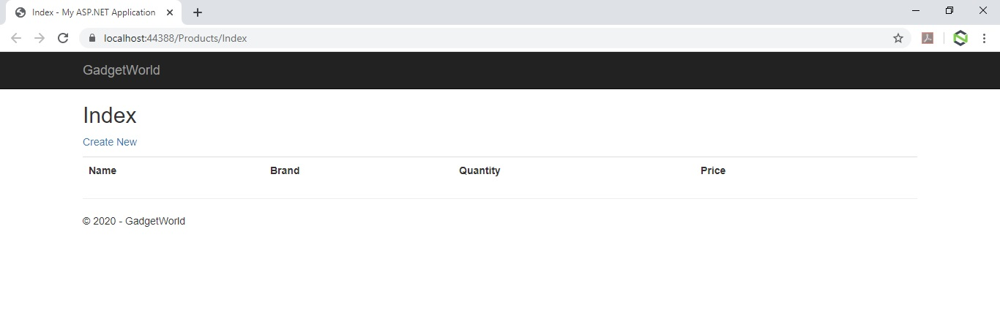
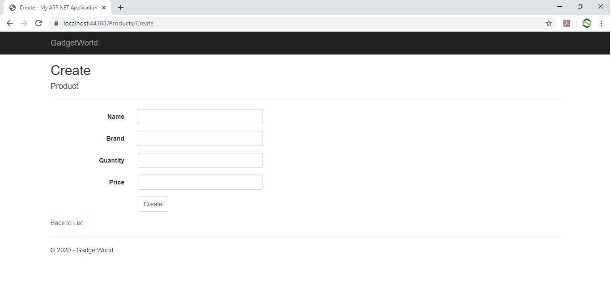
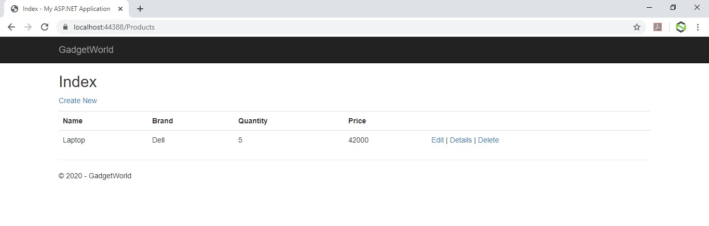
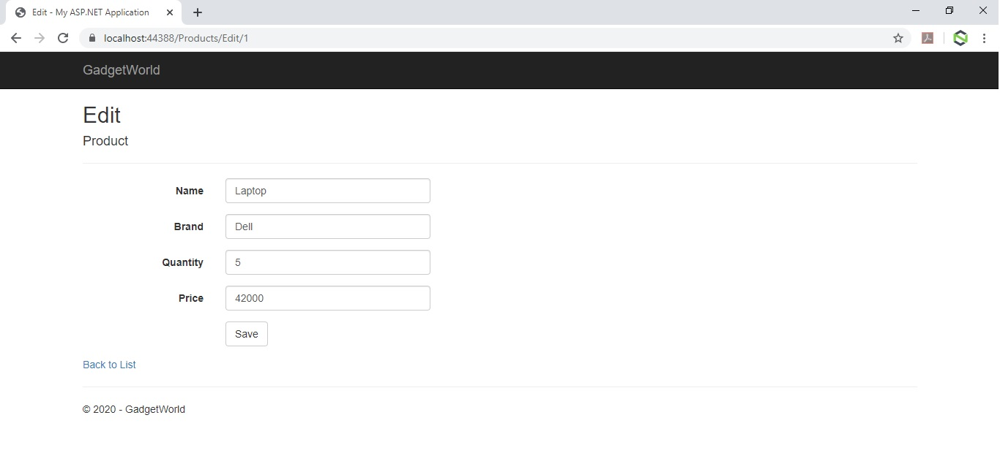
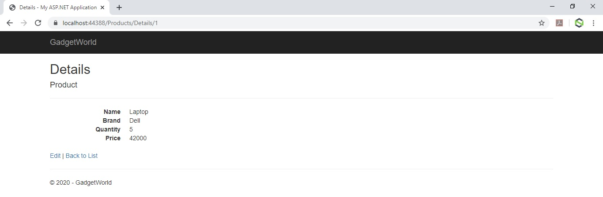
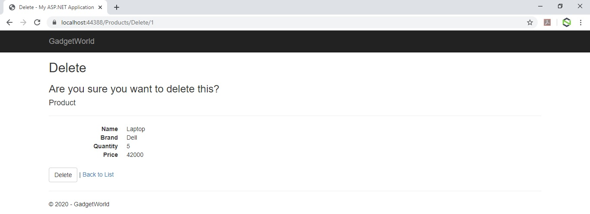

## ASP.Net MVC Exercise 5

### Objective
Create an ASP.Net MVC application and implement CRUD operations in database using Entity Framework.

### Problem Statement
* As a member of the development team at GlobalIT, you have developed a Web application for GadgetWorld, which consists of the following views:
    * Home: This view lists the products.
    * Upcoming Products: This view lists the name and description of the upcoming products.
    * About Us: This view displays a brief description about the company.
    * Contact Us: This view displays the details using which a user can contact GadgetWorld company.
* Now, you have been assigned a task to create views that allow the administrator of GadgetWorld to add, edit, and delete product details in database. In addition, you have to create a Web page that displays a list of added products.

Initially, the Product view is displayed, as shown in the following figure. A user can click the Create New link to add the details of a new Product.

The Create New Product view is displayed, as shown in the following figure.

Once the user clicks on the Create button after filling all the fields with valid values, the Product view displays the list of added Products, as shown in the following figure.

A user can edit and delete the added product. In addition, a user can view the details of a selected product. When a user clicks the Edit link, the Edit Product view is displayed, as shown in the following figure.

When a user clicks the Details link, the Details view is displayed, as shown in the following figure.

When a user clicks the Delete link, the Confirm Delete view is displayed, as shown in the following figure.

Once the user clicks the Delete button, the Product view is displayed.

## Solution
To implement the functionality of the Product view, you have created a Model named Product.
Now, you need to help your teammates to accomplish the preceding task.

### To solve the preceding problem, you need to perform the following tasks:
* Create a Product model.
* Create a database context.
* Configure the database location.
* Create the Product controller.
* Create required views.
* Execute the application and verify the output.

## Submitting Solution
1. Once the solution is ready push the code to git following the below steps :
    * Add `gitignore` file in your project before pushing the code on gitlab.
    * Create new project on git with the name `exercise5-solution`
    * On local machine in the folder where your solution code resides, run the command `git remote add origin <project-repo-url>`
    * To Stage files for commit, run the command `git add .`
    * To commit files, run the command `git commit -m '<commit-msg>'`
    * Finally to push the code, run the command `git push -u origin master`

2. Assign your Mentor as the Reporter for this git repo and notify him/her for the evaluation